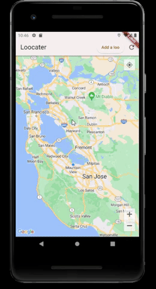
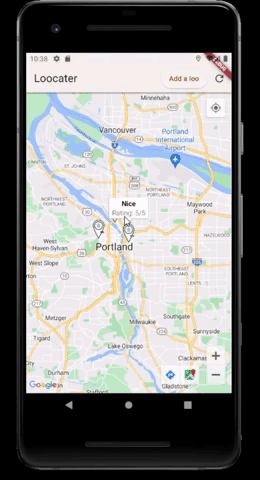

# Loocater
The "Loocater" app is a mobile application built in Flutter that helps users find and review public restrooms. Leveraging the power of Google Maps integration, the app provides a user-friendly interface to locate nearby restrooms, add new restroom locations, and leave reviews for existing restrooms.

## Features
- Interactive Map: Utilize the intuitive map interface powered by Google Maps to discover nearby public restrooms.
 
- Add New Restrooms: Enable users to contribute by adding new restroom locations to the app's database, ensuring the community benefits from the most up-to-date information.
 
- Review and Ratings: Allow users to share their experiences and provide ratings for restrooms they have visited, helping others make informed decisions.
 
- Search Functionality: Implement a search feature to enable users to find restrooms based on location, specific amenities, or accessibility options.
- Secure Authentication: Ensure user privacy and security with a robust authentication system that allows users to create accounts and securely access the app's features.
The "Loocater" app aims to make the process of finding and reviewing public restrooms convenient and reliable for users, enhancing their overall experience while on the go.

## Getting Loocater setup locally

1. Download and Install Node.js and npm:
- Visit the official Node.js website (https://nodejs.org) and download the appropriate version for your operating system.
- Run the installer and follow the instructions to install Node.js and npm.

2. Download and Install Flutter SDK:
- Visit the official Flutter website (https://flutter.dev) and download the Flutter SDK for your operating system.
- Extract the downloaded Flutter SDK to a directory of your choice.
- Add the Flutter SDK to your system's PATH:
  - Open your terminal or command prompt.
  - Run the following command to open your user or account-specific .bash_profile, .zshrc, or similar file: code ~/.bash_profile
  - Replace ~/.bash_profile with the path to your specific file if it has a different name or location.
  - Add the following line to the file: export PATH="$PATH:/path/to/flutter/bin"
  - Replace /path/to/flutter with the actual path to the Flutter SDK directory.
  - Save and close the file.
  - Run the following command to apply the changes: source ~/.bash_profile
  - Again, replace ~/.bash_profile with the path to your file if it has a different name or location.

3. Install Android Studio and Set Up an Emulator:
- Download Android Studio from the official website (https://developer.android.com/studio).
- Run the installer and follow the instructions to install Android Studio.
- Open Android Studio and go through the initial setup wizard.
- In the Android Studio welcome screen, click "Configure" at the bottom and select "SDK Manager".
- In the "SDK Platforms" tab, check the box for the desired Android versions you want to target.
- In the "SDK Tools" tab, check the box for "Android SDK Build-Tools" and "Android Emulator".
- Click "Apply" to install the selected components.
- Once the installation is complete, click "Finish" to exit the SDK Manager.
- Create a new Android Virtual Device (AVD) by following these steps:
  - Open Android Studio.
  - Click on the "Configure" button and select "AVD Manager".
  - Click "Create Virtual Device".
  - Choose a device definition and click "Next".
  - Select the desired system image and click "Next".
  - Configure the AVD options as needed and click "Finish".

4. Clone and Set Up the Preferred Potties Loocater Repository:
- Open your terminal or command prompt.
- Navigate to the directory where you want to clone the repository.
- Run the following command to clone the repository: git clone https://github.com/Preferred-Potties/loocater.git
- Navigate into the cloned repository: cd Loocater
- Install the project dependencies by running the following command: flutter pub get

5. Running the App:
- Open a terminal or command prompt.
- Navigate to the cloned repository: cd Loocater
- Navigate to the Express server directory: cd express
- Install the server dependencies: npm i
- Set up the database: npm run setup-db
- Start the Express server: npm start
 
- Open another terminal or command prompt.
- Navigate to the Flutter SDK directory: cd flutter
- Install the project dependencies by running the following command: flutter pub get
- Start your emulator in VSCode
- Run the app on a connected emulator or device: flutter run

## **Meet the team**
- Karl Wernsman - Lead Developer - [LinkedIn](https://www.linkedin.com/in/karl-wernsman/)
- Charlie Hengemihle - Lead Developer - [LinkedIn](https://www.linkedin.com/in/charliehengemihle/)
- Ashton Ruiz - [LinkedIn](https://www.linkedin.com/in/ashtonruiz333/)
- Steve Bryant - [LinkedIn](https://www.linkedin.com/in/bryant-steven/)

